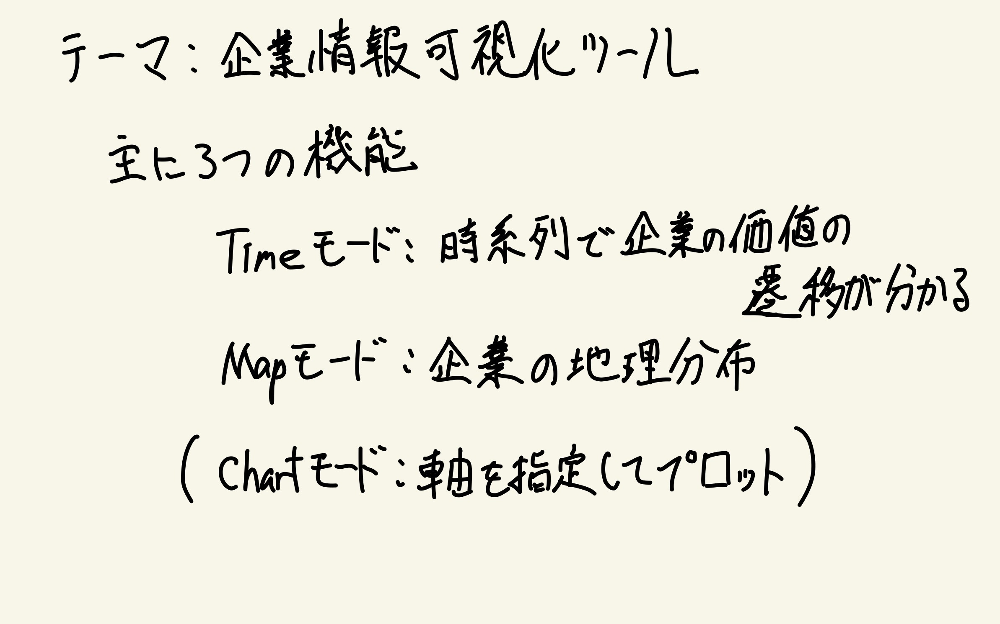
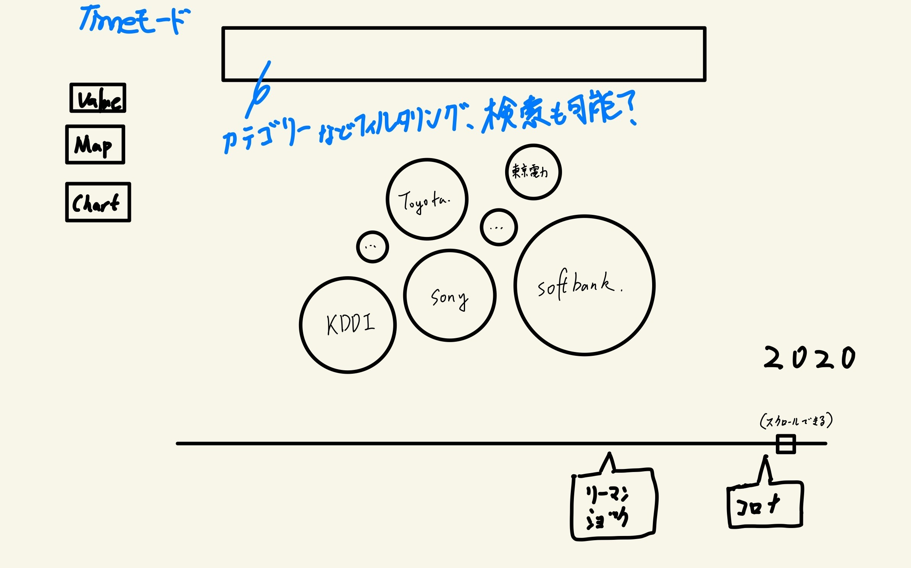
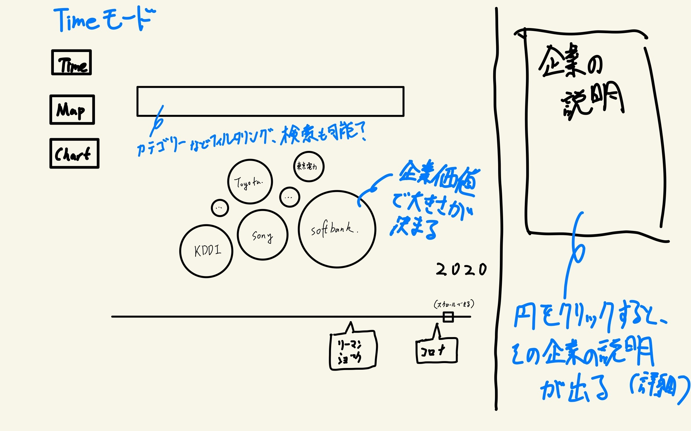
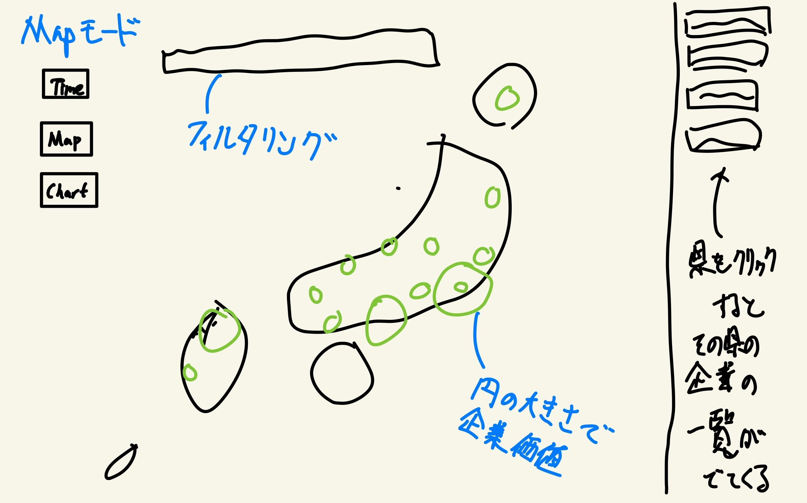
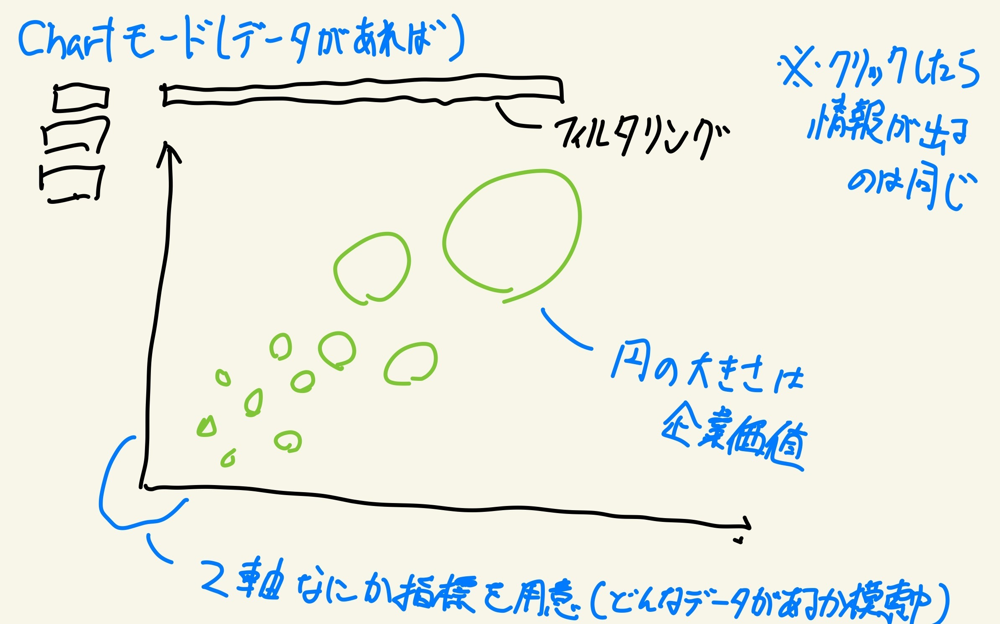

# InfoVis2021 team HOT

- [InfoVis2021 team HOT](#infovis2021-team-hot)
  - [最終成果物の場所](#最終成果物の場所)
  - [Theme](#theme)
  - [Paper Prototype](#paper-prototype)
    - [Timeモード](#timeモード)
    - [Mapモード](#mapモード)
    - [Chartモード](#chartモード)
  - [Peer Review](#peer-review)
  - [About Data](#about-data)

## 最終成果物の場所

[final_product](final_product/)にデータセット、ソースコードがあります。

[FPR](FPR/)にレポートと動画を提出しました。

## Theme
日本企業の情報可視化

<!-- ## 進捗
| 日付 | やったこと |
| :--- | :--- |
| ~12/2 | テーマ決め([議事録](./doc/themeLog.md))
| 12/2 | [Paper Prototype](#paper-prototype)の作成 |
| 12/6 | プロジェクトの開始、[ピアレビュー](#peer-review)、[データ収集](#about-data)の開始  孫：時価総額のデータスクレイピング、バブルチャートの雛形作成  大神：株価のデータスクレイピング  櫻井：README.mdなどドキュメントの整理、作成 |
| 12/7 | Hand-on課題と併せて既存のバブルチャートに自分達が使いそうな機能を追加し、コードの書き方を模索した  孫：時価総額のデータスクレイピングの続き、既存のバブルチャートにカテゴリーごとに出すカテゴリーを選べるようにした  大神：既存のバブルチャートにスクロールで大きさが変わる機能の追加（企業の時系列データの可視化に使用）  櫻井：既存のバブルチャートに円をクリックすることでサイドに詳細情報が出るような形にした。CSSのフレームワークを導入した|
| 12/9 | 今後の実装方針、データ、データ収集、役割分担などを話し合った([議事録](./doc/discussion1209.md))。議事録をとりながら**3人で**メチャクチャ議論しました！   孫：時価総額のデータスクレイピングコードのバグ修正、集めたデータを加工するコードの記述(具体的にはマージする)  大神：バブルチャートで時間軸を追加して動かすことを可能にした、時価総額のデータスクレイピング、会社情報が入ったcsvに関してデータ処理を行う  櫻井：ドキュメントの整理、openworkからのデータスクレイピングの開始 |
| 12/13 ||
| 12/14 ||
| 12/16 ||
| 12/20 || -->

## Paper Prototype

可視化するテーマは日本の企業のさまざまな情報である。
- Timeモード
- Mapモード
- Chartモード

の３つのモードを作り、いろいろな角度から日本企業の過去、現在の情報を可視化することを目的としている。

### Timeモード

Timeモードでは、円の大きさを企業の価値の価値として、その時間的変化
を観察する。下のバーをスクロールすることで、時期を指定することができ、また、周辺に起きた出来事を表示することで、その出来事により何が起きたかの推移を観察することができる。

また、上のバーの部分ではカテゴリー別や、企業検索などのフィルタリングをするようにする。

企業の円をクリックすると、その企業の詳細情報のページが横に出るようにする。

### Mapモード

Mapモードでは企業の地理分布を可視化する。こちらも円の大きさで企業価値を表現し、フィルタリング機能も同様につける。また、県をクリックすると、その県の企業の一覧が出てくるようにし、また、その一覧からTimeモードと同様に企業の詳細情報も閲覧することができる。

### Chartモード

Chartモードは2軸なにか指標を用意し、その軸に沿って企業をプロットする。（具体的なデータの種類は模索中）
こちらも先ほどまでと同様クリックすることで企業情報を見ることができるようにする。

## Peer Review
他の班、TAを交えて現状のペーパープロトタイプに意見、アドバイスをいただいた。(アドバイス一覧は[ここ](./doc/PeerReview.md))
アドバイスを踏まえて、Mapモードの表し方の工夫、Chartモードの指標のデータ収集が必要であることが確認できた。

## About Data
データの収集に関するメモは[ここ](./doc/DataCollection.md)